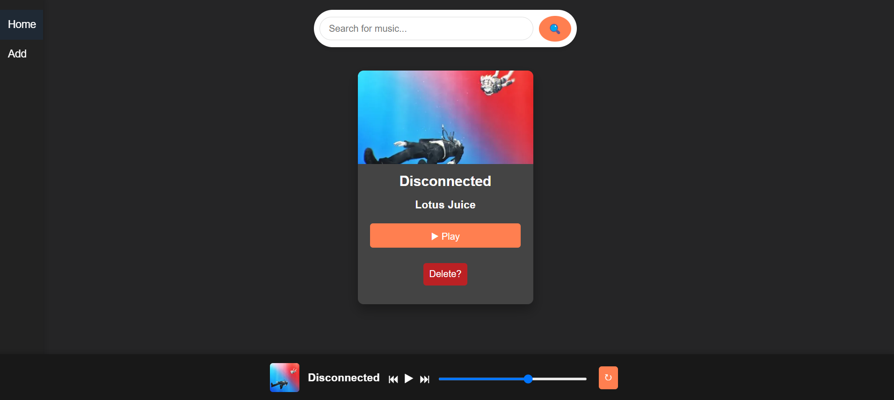

# 🎵 Music Player Web App 🎶
A simple, modern, and responsive music player web application built using **Flask** for the backend and **HTML/CSS** for the frontend. This app allows users to add, play, search, and delete their favorite music tracks.

---

## Features 🔥
- 🎶 **Play music**: Play your favorite songs directly from the browser.
- 🔍 **Search**: Easily search for songs by title or artist.
- ➕ **Add music**: Upload new tracks with cover images to your collection.
- 🗑️ **Delete music**: Remove tracks you no longer want in your library.
- 🔁 **Loop**: Enable the loop feature to repeat tracks endlessly.
- 📱 **Responsive design**: Fully responsive, looks great on mobile and desktop!

---

## 📦 Installation

To run this application locally, follow these steps:

1. **Clone the repository**:


2. **Navigate to the project folder**:
    ```bash
    cd music-player

3. **Create a virtual environment**:
    ```bash
    python3 -m venv venv

4. **Activate the virtual environment**:
    ```bash
    venv\Scripts\activate

5. **Run the Flask app**:
    ```bash
    flask run

# 💻 Usage
Adding music: Go to the 'Add Music' page to upload audio files and images.

1. **Playing music**: Click on the play button ▶️ for any track in your library.

2. **Searching**: Use the search bar 🔍 to find your favorite music by title or artist.

3. **Looping tracks**: Click the loop button 🔁 to play a song on repeat.

 # 🧑‍💻 Technologies Used
+ Backend: Flask 🐍

+ Frontend: HTML5, CSS3, JavaScript

+ Database: SQLite 🗄️

+ Audio Player: Custom audio player built with HTML5 <audio> 🎶


(I'm a huge Persona fan)